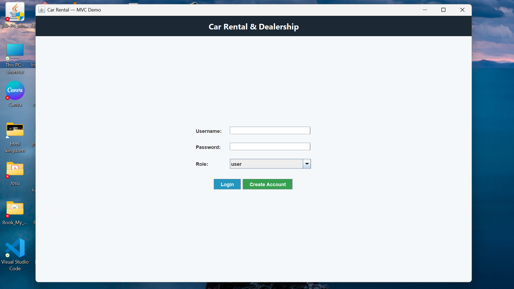

# 🚗 Book My Vandi – Car Rental Management System

A modern **Java Swing**-based desktop application for managing car rentals with integrated user authentication, admin management, and local database persistence using **SQLite**.  
Developed as part of an academic project under **Object-Oriented Programming (OOP)**, this system demonstrates full **CRUD operations**, clean **MVC architecture**, and a user-friendly **graphical interface**.

---

## 📋 Project Overview

**Book My Vandi** is a comprehensive car rental management system that simplifies the process of booking, managing, and monitoring cars for rent.  
The app supports **three roles** — **User**, **Seller**, and **Admin** — providing a smooth and secure workflow for every participant.

---

## 🎯 Key Features

### 👥 User
- Create an account and log in.
- Browse available cars.
- Book cars for specific days.
- View booking history and confirmations.

### 🚘 Seller
- Add, edit, and remove cars.
- View and confirm customer bookings.
- Manage messages and booking updates.

### 🧑‍💼 Admin
- Manage users and sellers.
- Oversee all bookings.
- Control car listings and database activity.

---

## 📁 Project Structure


📁 CarBookingSystem (Root Folder)
│
├── 📁 src (Source code folder)
│ ├── 📁 model
│ │ ├── Bookings.java
│ │ ├── Car.java
│ │ ├── User.java
│ │
│ ├── 📁 controller
│ │ ├── BookingController.java
│ │ ├── CarController.java
│ │ ├── UserController.java
│ │
│ ├── 📁 view
│ │ ├── MainFrame.java
│ │ ├── MainFrame$AdminPanel$1.class
│ │ ├── MainFrame$AllBookingsPanel.class
│ │ ├── MainFrame$BookingDialog.class
│ │ └── ... (Other View classes)
│
│ ├── 📁 dao
│ │ └── (Future DAO classes for DB queries)
│
│ ├── 📁 database
│ │ └── DBConnection.java
│
│ ├── 📁 utils
│ │ └── UIUtils.java
│
│ └── MainFrame.class
│
├── 📁 resources
│ ├── 📁 images
│ │ ├── 3c785b81-d412-44da-8a9e-b071741517f8.png
│ │ ├── 72f8e19a-9120-406b-bff2-52d4cc1de827.png
│ │ └── ... (Other images)
│
│ ├── 📁 screenshots
│ │ ├── Account Creation Confirmation.png
│ │ ├── Admin Loggin.png
│ │ ├── Booking History.png
│ │ └── ... (Other UI screenshots)
│
└── 📁 bin
├── 📁 model
│ ├── Bookings.class
│ ├── Car.class
│ ├── User.class
│
├── 📁 controller
│ └── ... (Controller .class files)
│
├── 📁 view
│ ├── MainFrame.class
│ ├── MainFrame$AdminPanel.class
│ └── ... (Other View .class files)
│
├── 📁 database
│ └── DBConnection.class
│
└── 📁 utils
└── UIUtils.class

---

## 🖼️ Application Screenshots

| Screen | Preview |
|--------|----------|
| **Main Login Page** |  |
| **Account Creation** |  |
| **Create Account** |  |
| **OTP Verification** |  |
| **User Login** |  |
| **User Dashboard** |  |
| **Booking Demo** |  |
| **Booking Confirmation** |  |
| **Seller Login** |  |
| **Seller Confirmation** |  |
| **Admin Login** |  |
| **Admin Manage Cars** |  |
| **Admin All Bookings** |  |

---

## ⚙️ Tech Stack

- **Language:** Java (JDK 17+)
- **Framework:** Swing (Java GUI)
- **Database:** SQLite (via `sqlite-jdbc`)
- **Architecture:** MVC (Model–View–Controller)
- **IDE Recommended:** IntelliJ IDEA / Eclipse

---

## 🧱 Installation & Setup

### 1️⃣ Clone the Repository
```bash
git clone https://github.com/alwinjosegeorge/Book_My_Vandi.git
