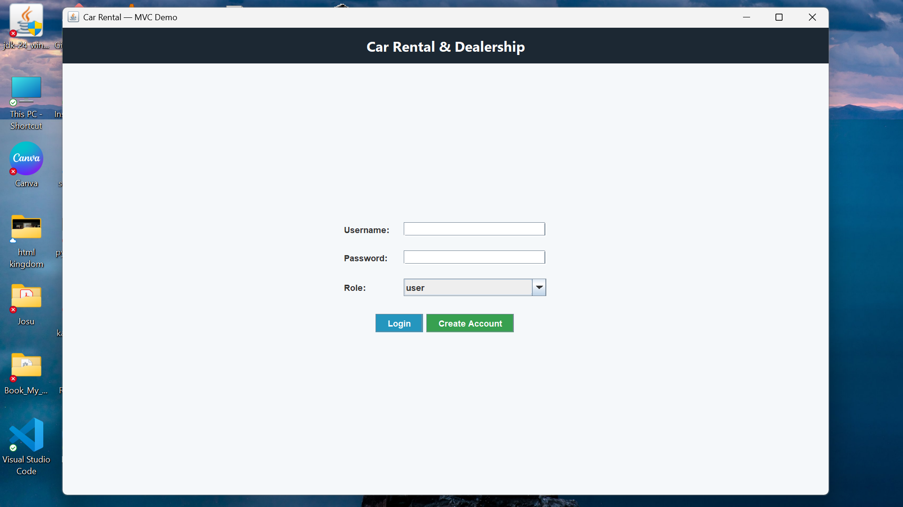

<p align="center">
    
  </a>
</p>

# 🚗 Book My Vandi – Car Rental Management System

[](https://www.java.com/)
[](https://www.sqlite.org/)
[]()
[](LICENSE)

A modern **Java Swing-based desktop application** for managing car rentals with integrated **user authentication**, **admin management**, and **local database persistence** using **SQLite**.  

Developed as part of an **academic Object-Oriented Programming (OOP)** project, this system demonstrates **complete CRUD operations**, a **modular MVC structure**, and a **professional GUI interface**.

---

## 📋 Project Overview

**Book My Vandi** is a full-featured desktop solution designed for **booking, managing, and monitoring car rentals**.  
It offers dedicated roles for **Admin**, **Seller**, and **User**, each with distinct access permissions and workflows to ensure secure and efficient system operation.

---
## 📘 User Manual

For a complete guide on installation, features, and usage, refer to the official **User Manual** below.  

📄 [👉 Click here to open the User Manual (PDF)](User_Manual.pdf)

> The User Manual includes step-by-step setup instructions, screenshots, and feature explanations for Admin, Seller, and User modules.

---


## 🎯 Key Features

### 👥 User
- 🧾 Create an account and log in securely.  
- 🚙 Browse and search for available cars.  
- 📅 Book cars for specific dates.  
- 📜 View booking history and confirmations.  

### 🧑‍💼 Seller
- 🚗 Add, edit, or remove car listings.  
- 📥 View and confirm booking requests.  
- 💬 Manage customer messages and booking details.  

### 🛠️ Admin
- 👤 Manage all registered users and sellers.  
- 🚘 Oversee all vehicle data and bookings.  
- 🧾 Maintain system logs and database integrity.  

---

## 🧩 Overview

**Book My Vandi** is a desktop-based car rental management system that simplifies vehicle booking, approval, and tracking.  
It’s designed with a professional MVC structure using **Java Swing** for the frontend and **SQLite** for persistent local data storage.  

This project ensures smooth management of customers, cars, and bookings — ideal for small rental agencies and college project demonstrations.

---

## 📁 Project Structure

```
Book_My_Vandi/
│
├── src/
│   ├── controller/     # Application logic and event handling
│   ├── database/       # SQLite DB connection handler
│   ├── model/          # Data models (User, Car, Booking)
│   ├── view/           # UI forms and dashboards
│   └── MainFrame.java  # Main application entry point
│
├── Screenshot/         # Screenshots for documentation
│
├── sqlite-jdbc.jar     # SQLite JDBC Driver
└── README.md
```

---

## 🖼️ Application Screenshots

| Screen | Preview |
|--------|----------|
| **Main Login Page** |  |
| **Create Account** |  |
| **OTP Verification** |  |
| **User Login** |  |
| **User Dashboard** |  |
| **Booking Demo** |  |
| **Booking Confirmation** |  |
| **Seller Login** |  |
| **Seller Confirmation** |  |
| **Admin Login** |  |
| **Admin Manage Cars** |  |
| **All Bookings (Admin)** |  |


---

## ⚙️ Tech Stack

| Component | Technology |
|:-----------|:------------|
| **Language** | Java (JDK 17+) |
| **Framework** | Java Swing |
| **Database** | SQLite (via `sqlite-jdbc`) |
| **Architecture** | MVC (Model–View–Controller) |
| **IDE Recommended** | IntelliJ IDEA / Eclipse |
| **Build Tool** | Manual compile or IDE build |

---

## 🧱 Installation & Setup

### 1️⃣ Clone the repository
```bash
git clone https://github.com/alwinjosegeorge/Book_My_Vandi.git
```

### 2️⃣ Add the SQLite JDBC Driver
Download the required version of `sqlite-jdbc` and place it in your project directory.

### 3️⃣ Compile the project
```bash
javac -cp ".;sqlite-jdbc.jar" src/*.java
```

### 4️⃣ Run the application
```bash
java -cp ".;sqlite-jdbc.jar" src.MainFrame
```

💡 You can also open the project directly in **IntelliJ IDEA** or **Eclipse** and run the main file.

---

## 🚀 Future Enhancements

- 🌐 Online database connectivity (MySQL / Firebase)  
- 💳 Integrated payment gateway  
- 📱 Mobile-friendly UI using JavaFX or React Native  
- 🔔 Email / SMS booking notifications  
- 🧠 AI-based car recommendation and pricing engine  

---

## 👨‍💻 Team Members

| Member | GitHub | Role |
|---------|---------|------|
| **Alwin Jose George** | [@alwinjosegeorge](https://github.com/alwinjosegeorge) | Full Stack Developer |
| **Joe Martin Rince** | [@JoeMartinRince](https://github.com/JoeMartinRince) | UI & Database Design  |
| **Febin Nobel** | [@febin-04](https://github.com/febin-04) | Backend Developer |
| **Alex Roy** | [@AlexRoy2006](https://github.com/AlexRoy2006) | Testing & Documentation |

---

## 📜 License

This project is licensed under the **MIT License**.  
You may use, modify, and distribute this software with proper attribution.

---

### 💡 Made with ❤️ by **Team Book My Vandi**
